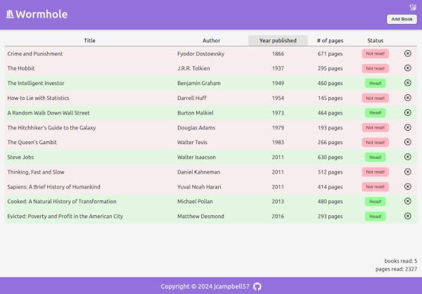
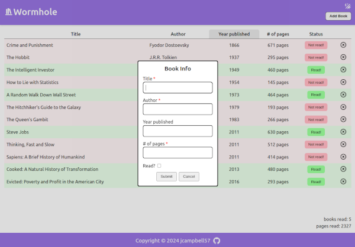
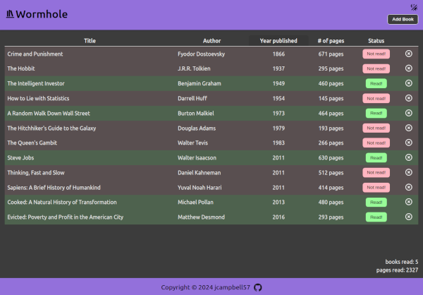
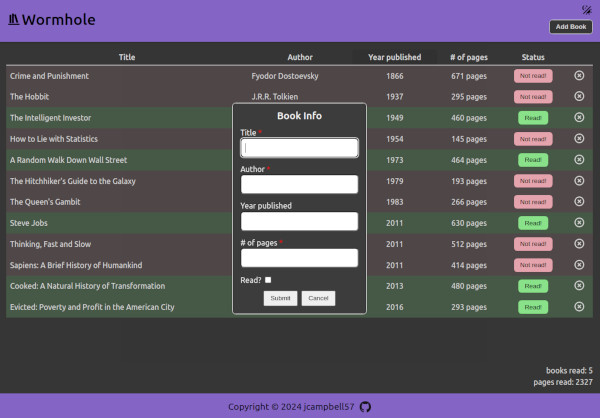

# odin-library

For this project, I will build a simple interactive book list. Project description can be found here:

https://www.theodinproject.com/lessons/advanced-html-and-css-homepage

## Live demo

Live demo available [here](https://jcampbell57.github.io/odin-library/v2/)

## Features

- Ability to add books to the table
- sortable table columns
- Interactive 'read' status
- stats display with number of books and total pages read
- Ability to delete books from the table
- dark mode toggle
- localStorage integration to save books, as well as theme and column sorting preferences

## Improvements

This project could be improved with:
- a transition or animation for the dialog modal display

## Project Screenshots

### Wormhole (light mode):

 

### Add book (light mode):

 

### Wormhole (dark mode):

 

### Add book (dark mode):

